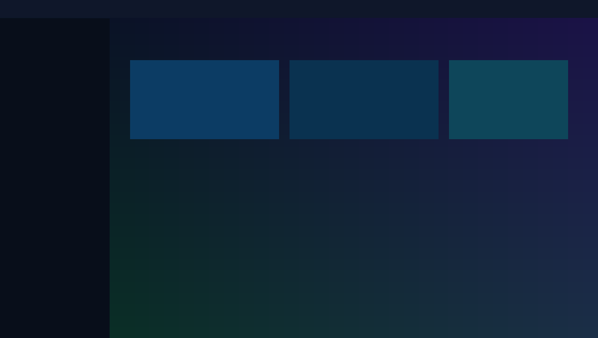

# 115VAC变频交流发电软件测试平台 (26-vac-test-bid)

- **线上预览 / Host Link**: [https://26-vac-test-bid.softwarelink.net/](https://26-vac-test-bid.softwarelink.net/)
- **代码仓库 / Repo Link**: [https://github.com/softwarelink-net/26-vac-test-bid](https://github.com/softwarelink-net/26-vac-test-bid)



## 部署与运行说明

### 环境要求
- Node.js >= 20.0.0
- npm >= 10.0.0
- Cloudflare Wrangler CLI >= 3.80.0

### 安装依赖
```bash
npm install
```

### 本地运行
```bash
# 启动本地全栈开发环境（含 Cloudflare D1 本地仿真与 Vite 开发服务器）
npm run dev
```

### 演示账号
- **管理员**: `admin@avic-sepc.com` / `Admin@2026!Sec`
- **适航验证工程师**: `tester@avic-sepc.com` / `Tester@2026!Sec`
- **安全审计员**: `auditor@avic-sepc.com` / `Auditor@2026!Sec`

### 生产构建与部署
```bash
# 执行前端生产打包与后端 Worker 编译
npm run build

# 部署至 Cloudflare Workers 全球无服务器边缘网络
npm run deploy
```

### 常用脚本一览
- `npm run dev`: 启动本地全栈开发环境
- `npm run build`: 前端与 Worker 构建打包
- `npm run deploy`: 部署至 Cloudflare 生产环境
- `npm run db:migrate:local`: 执行本地 D1 数据库迁移
- `npm run db:seed:local`: 填充本地 D1 初始种子数据
- `npm run db:migrate:prod`: 执行生产环境 D1 数据库迁移

### 目录结构
```text
26-vac-test-bid/
├── docs/assets/              # 静态文档与截图资产
├── src/                      # 前端 Vue 3 核心工程
│   ├── assets/               # 样式与图像资源
│   ├── components/           # 通用原子组件与业务复合组件
│   ├── layouts/              # AuthLayout / MainLayout
│   ├── router/               # 路由定义与 RBAC 导航守卫
│   ├── stores/               # Pinia 状态管理
│   ├── views/                # 业务视图页面
│   ├── App.vue               # 根组件（含顶部不可折叠 Banner）
│   └── main.js               # 应用入口
├── functions/                # Cloudflare Worker / API 路由实现
│   ├── api/
│   │   ├── auth/             # 认证与 Token 校验
│   │   ├── tenders/          # 标讯与资质审查接口
│   │   ├── identification/   # 参数辨识与拟合算法接口
│   │   ├── test-bench/       # 测试台程控与用例执行接口
│   │   └── waveform/         # 瞬态波形数据采集与分析
│   └── [[path]].js           # 全局路由分发与上下文绑定
├── migrations/               # Cloudflare D1 SQL 迁移脚本
│   └── 0001_initial_schema.sql
├── wrangler.toml             # Cloudflare 架构配置文件
├── package.json              # 项目依赖与脚本定义
├── tailwind.config.js        # Tailwind 样式配置
└── vite.config.js            # Vite 构建配置
```

## 招标公告全文

- **标题**: 115VAC变频交流发电软件测试平台招标公告
- **项目发包方**: 陕西航空电气有限责任公司
- **项目编号**: 0730-2611010438/01
- **项目发布时间**: 2026/08/13 18:03:43
- **关键词**: 陕西航空电气有限责任公司, 115VAC变频交流发电, 软件测试平台, DO-178C, 发电调压软件, 0730-2611010438/01, 航空电气招标, 西安招标
- **摘要**: 陕西航空电气有限责任公司发布115VAC变频交流发电软件测试平台采购招标公告，主要针对主发电系统软件开发、测试、优化的需求，用于实现发电软件功能测试、不同工况下调压性能测试，保障测试需求覆盖度，解决当前无专用瞬态测试环境、参数无法辨识、发电调压软件模块不能独立闭环验证、系统试验台资源冲突等核心问题，满足 DO-178C 适航标准对需求覆盖的测试要求。
- **技术要点**:
  1. 平台由三级式发电机数字调压软件参数辨识设备、模块化变频发电软件程控集成测试台、发电调压软件瞬态实时测试工具三部分组成。
  2. 实现主发电系统调压软件独立闭环验证，保障调压控制精度、动态响应与 115VAC/360Hz-800Hz 变频供电品质。
  3. 全面覆盖突加/突卸负载、单相短路、过压欠压保护等瞬态工况高频采样与故障注入。
- **技术创新性**:
  1. 构建数字仿真与实时物理量交互的虚拟闭环架构，突破物理试验台架排队与资源冲突瓶颈。
  2. 针对三级式发电机多级耦合非线性特性的微秒级参数高精度实时辨识算法。
  3. 深度嵌入 DO-178C 适航追踪链，实现需求-用例-覆盖率-审计证据链的自动化贯通。

## 免责声明

1. **数据来源与合规性**：本系统展示的所有招标信息、项目背景及采购需求均来源于公开招投标平台（如中国招标投标公共服务平台、中国建设银行龙集采平台等）。系统仅用于技术方案演示、架构原型验证与演示搭建，不涉及任何商业非法抓取或数据篡改。
2. **技术实现路径**：本系统前端基于 Vue 3 + Tailwind CSS 构建，后端基于 Cloudflare Workers 极简无服务器架构，数据存储采用 Cloudflare D1 关系型数据库，完整符合分布式高可用与银企对接安全标准。
3. **保密承诺**：开发团队严格遵守保密义务，系统内示例数据均经过伪化脱敏处理（Anonymized），不包含真实患者医疗健康信息（PHI）或建行敏感金融交易数据。
4. **知识产权与巧合声明**：本系统中涉及的商标、机构名称（中国建设银行、川北医学院附属医院等）归各自合法持有人所有。演示代码与系统架构若与实际投产系统存在相似之处，纯属技术通用设计之巧合。
5. **免责条款**：本演示系统不具备实际金融扣款功能，不承担因非授权使用、不可抗力或第三方平台接口变更所导致的任何法律责任与经济损失。
